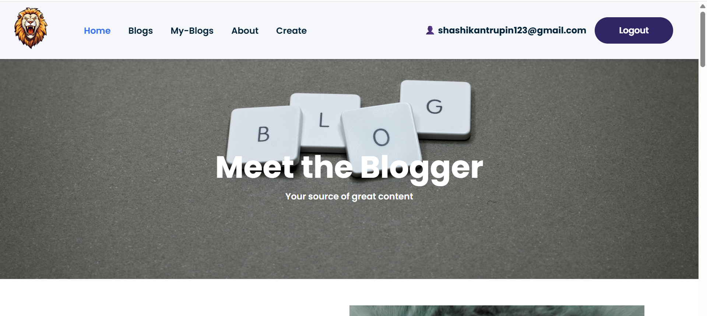
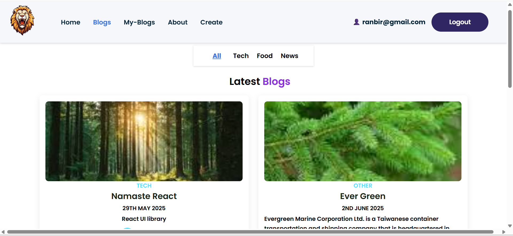
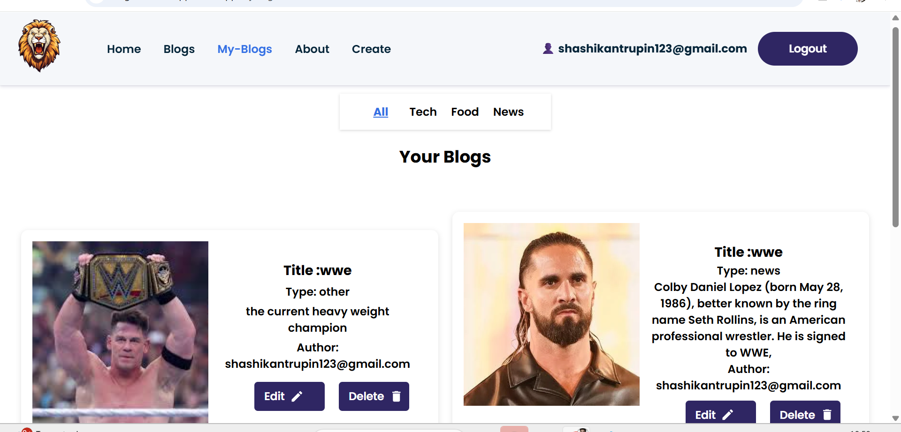
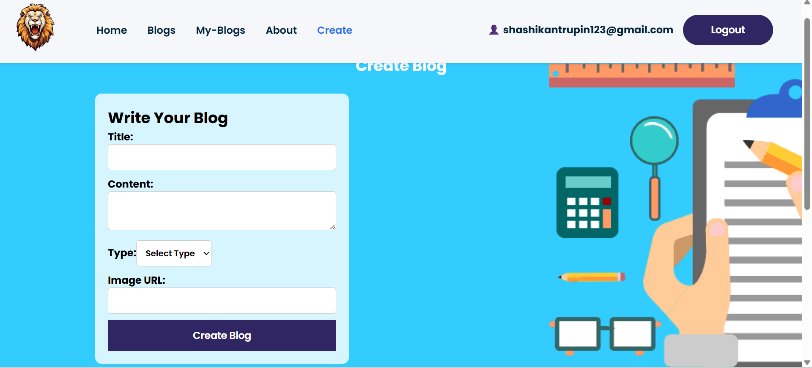

# 📝 Fullstack Blog Application (MERN Stack)

A full-featured blog application where users can sign up, log in, create, view, update, and delete blog posts. Built with the **MERN** stack (MongoDB, Express.js, React.js, Node.js) and deployed on **Render** (backend) and **Vercel** (frontend).

---

## 📖 Overview

This is a full-stack blogging platform demonstrating:

- 🧠 Authentication via JWT and React Context API
- ✍️ Blog CRUD (Create, Read, Update, Delete)
- 🚦 Client-side routing with React Router
- 💾 MongoDB-based persistent storage with Mongoose
- 🖥️ API-based communication between frontend and backend
- ☁️ Seamless deployment on Render and Vercel
- 📱 Responsive design using plain CSS

---

## 🚀 Live Demo

- 🌐 **Frontend**: [Vercel Deployment](https://blognestvercelapp.vercel.app/)

---

## 📸 Screenshots

> Located in `/ss` folder

### 🏠 Home Page


### 📰 Blog Page


### 📂 My Blogs Page


### ✍️ Create Blog Page


---

## 📌 Features

- ✅ User Registration and Login (JWT Authentication)
- 🔐 Authenticated routes using JWT and React Context API
- 📄 View all blogs posted by any user
- ✍️ Create, update, and delete own blogs
- 👤 “My Blogs” section: shows only the logged-in user's blogs
- 💻 Fully responsive UI using plain CSS
- 🌐 Routing handled using React Router
- ☁️ Deployed on Vercel (Frontend) and Render (Backend)

---

## 🛠️ Tech Stack

### 🔧 Frontend
- React.js
- React Router DOM
- Context API (for authentication)
- Plain CSS

### 🖥️ Backend
- Node.js
- Express.js
- MongoDB (Mongoose)
- JWT for authentication

### 🚀 Deployment
- Vercel (Frontend)
- Render (Backend)

---

## 🧑‍💻 Getting Started (Local Setup)

### 1️⃣ Clone the Repository

```bash
git clone https://github.com/shashikantRupin/mern-blog-app
